Authors:
Shira Ochana - id = 325191211
Email:
shiraoc@edu.hac.ac.il
I used server side in Node.js,
and in the SQL database type,
I wrote tables in phpMyAdmin and created an API interface for input and retrieval,
I created 3 tables:
*A table for patient details called users and contains: ID card, first name, last name, city of residence, street, home address, telephone, mobile phone.
  The income API: http://localhost:3000/addPatient/?
And you need to enter all the details of the table.
Photocopy of the income:
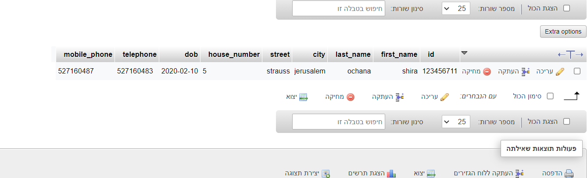

  The retrieval API:http://localhost:3000/getPatient/?
And you need to add the user's ID card.
  The retrieval photo:
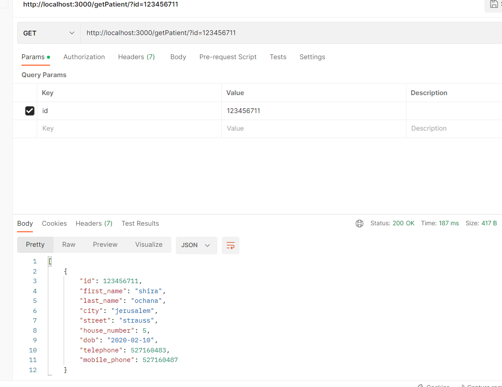

*Table for date of positive test results and date of recovery called date of corona results and contains: ID card, date of positive result and date of recovery.
  The income API: http://localhost:3000/addCoronaResultsDates/?
And you need to enter all the details of the table.
Photocopy of the income:
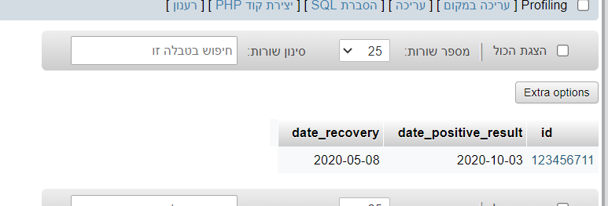
  The retrieval API:http://localhost:3000/getCoronaResultsDates/?id
And you need to add the user's ID card.
 The retrieval photo:
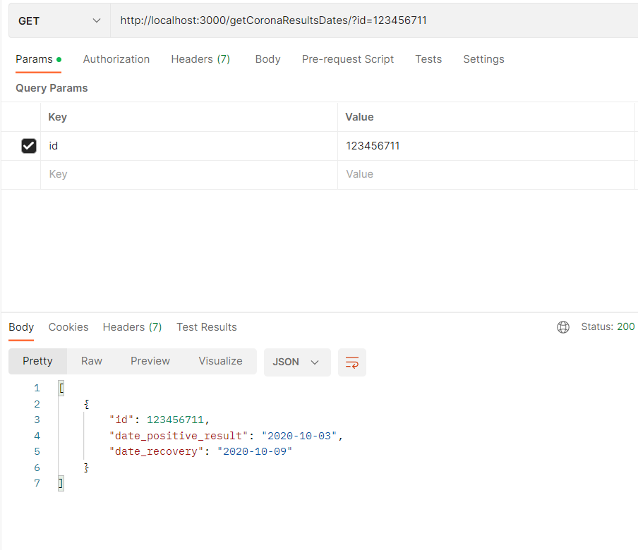
*A table for vaccinations called vaccination details and contains: ID card, date of vaccination and type of vaccination.
  The income API: http://localhost:3000/addVaccinationDetails/?id
And you need to enter all the details of the table.
Photocopy of the income:
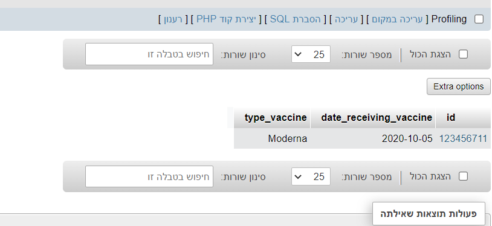
  The retrieval API:http://localhost:3000/getVaccinationDetails/?
And you need to add the user's ID card.
The retrieval photo:
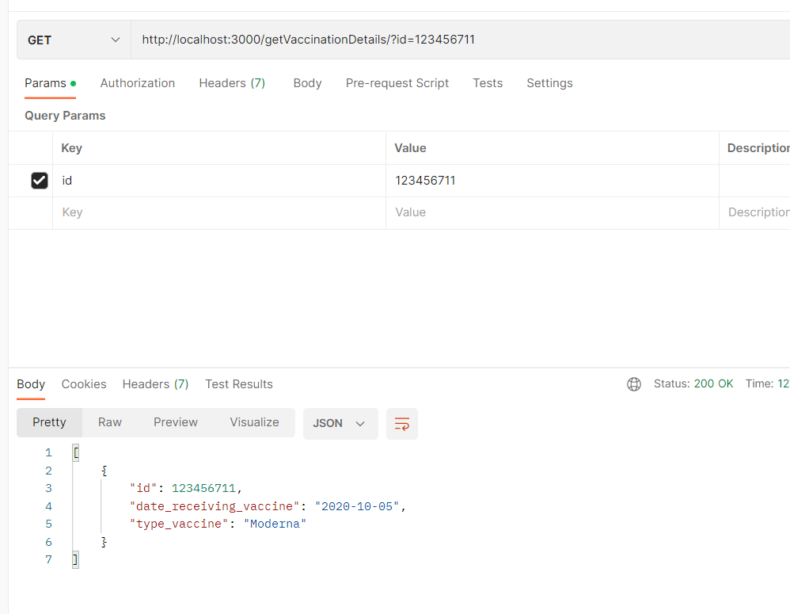

*Retrieving patient data from the three tables (all data on the patient)
the retrieval:http://localhost:3000/getPatientData/
And you need to enter the patient's ID
The retrieval photo:
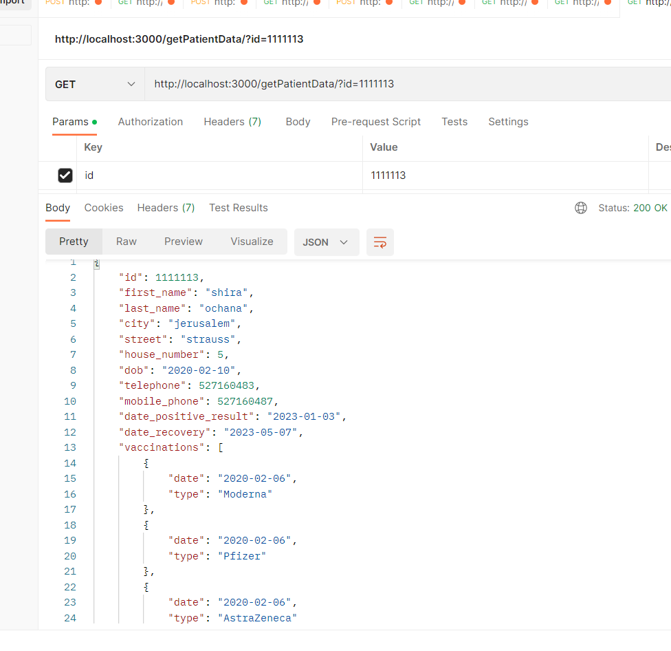

Bonus question Question 3:
Section A:(How many active patients were there each day in the last month?)
GET:http://localhost:3000/getActivePatientsByMonth
The request was sent with the appropriate month and year values (without the user entering).
And you can see the table data of the date of a positive result:
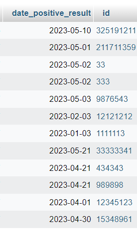
picture of the result:
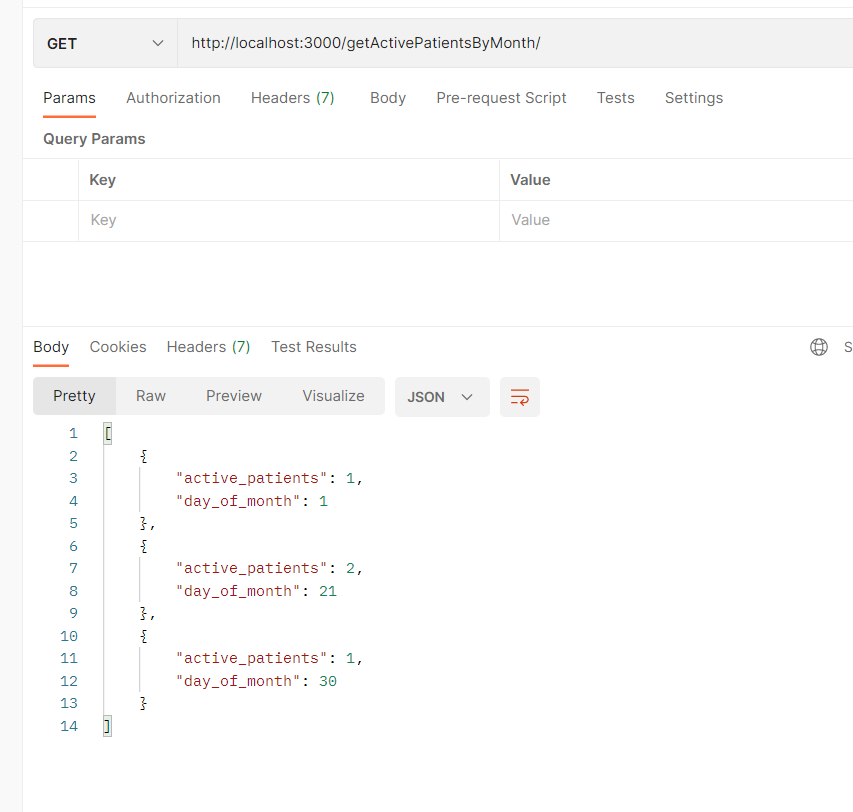
Section B: (How many Copa members are not vaccinated at all?)
GET:http://localhost:3000/getUnvaccinatedUsersCount
Picture of the table users:
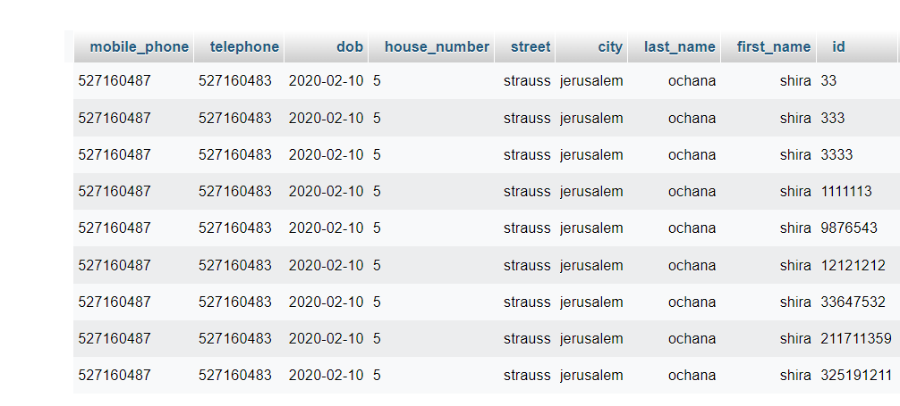
Picture of the table vaccination_details:
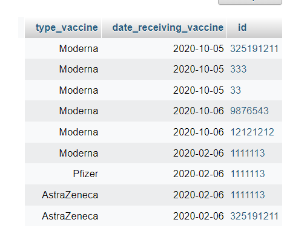
And a picture of the result:
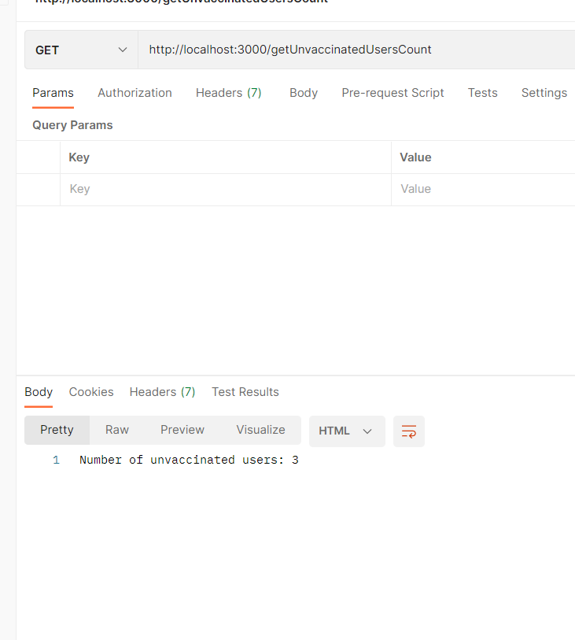